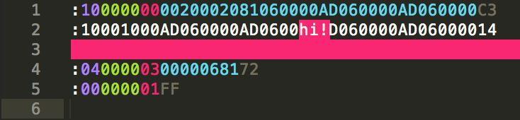

Intel HEX file format syntax definition
=======================================

This is a [Sublime Text 3](https://www.sublimetext.com/3) syntax definition for
the [Intel HEX file format](https://en.wikipedia.org/wiki/Intel_HEX).
It's designed to help with inspecting your hex files by setting a different
color for a record's length, address, type, data and checksum allowing to
more easily distinguish them.

The scopes have been somewhat hackisly chosen to be consistent with the
[Intel_HEX template on Wikipedia](https://en.wikipedia.org/wiki/Template:Intel_HEX)
when using Sublime Text's default Monokai color scheme. They have no other
meaning in any way.

Thanks to @vaibhavbhat16 for providing the `.tmLanguage` file to support ST2.
